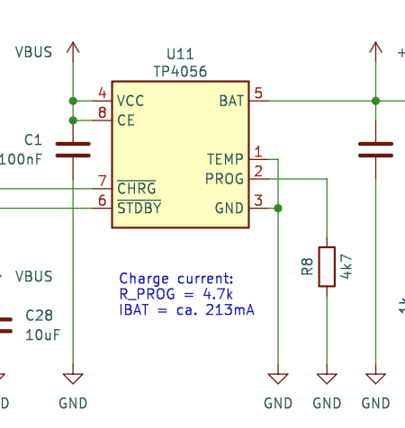
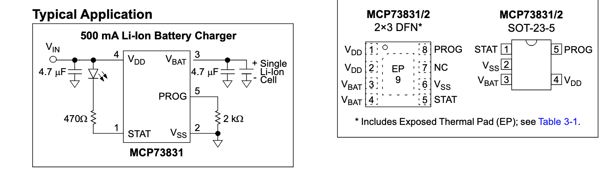

# OMOTE - Open Universal Remote - Hardware

## Overview

This is my version of the OMOTE project. Please see the original [here](https://github.com/OMOTE-Community/OMOTE-Hardware). It is an ESP32-based open-source universal remote. Its 2.8" capacitive touchscreen provides an intuitive and responsive user interface for switching devices and settings. No hub or docking station is required, as the remote features infrared, Wi‑Fi, and Bluetooth connectivity. With its well-optimized power consumption, OMOTE can run for months on a single charge. 

  

### Features
- 2.8" 320×240 px capacitive touchscreen
- Ergonomic, fully 3D-printed case
- Built-in infrared, Wi‑Fi, and Bluetooth
- Press any button or simply lift the remote to wake it
- Up to six months of battery life using a 2000 mAh Li‑Po battery

### This fork of OMOTE

This fork has a few differences:
* The vias on the ESP32 have been enlarged to help reduce manufacturing cost.
* A BOM (`omote.csv`) for Digi‑Key has been included to help source parts.

### Errata

⚠️
The most significant issue (for me) is that the battery terminal connector is reversed compared to shipped lithium‑ion battery packs. After some research it seems that the battery terminal polarity is not standardized; it could have caused serious damage if I hadn't noticed. ⚠️⚡

The current board and BOM have the following issues:
1. The vias under the ESP32 are not connected to ground; this will be modified manually.
1. The USB TVS diodes i ordered (listed in my digikey [BOM](https://github.com/rochuck/OMOTE-Hardware/blob/main/PCB/omote.csv)) are the wrong part. For now, I've removed the part and used 0 Ω resistors.
1. The CH340C was unavailable from Digi‑Key; a CH340G module was used instead. The CH340G requires an external crystal, which was taken from its adapter board.
1. The Li‑ion charger is unavailable from Digi‑Key. An MCP73831T2ACI/OT (SOT‑23‑5) is being used temporarily until the correct part can be sourced from AliExpress.

These changes are shown here:

  

## Charger changes

As shown in the diagrams below:

### TP4056
* On the TP4056, the TEMP pin is not used and is grounded.
* The 4.7 kΩ resistor sets the charge current to approximately 300 mA.
* The STANDBY pin goes low when not charging; the LED indicates charging.
* The CHRG pin is pulled low when charging; this is read by the microcontroller.

### MCP73831
* The STAT pin serves as the charging indicator and could be connected to the microcontroller, but it will require a pull-up. We will leave this disconnected for now.
* The PROG resistor at 4.7 kΩ results in a slightly lower charge current — approximately 213 mA at 4.2 V.

### The upshot

| Function | TP4056 pin | MCP pin |
|---|---:|---:|
| VCC | 4 | 4 |
| GND | 3 | 2 |
| PROG | 2 | 5 |
| BATT | 5 | 3 |

  

  

### Building the hardware

It was easy to order the board from JLCPCB. If I had a do-over, I would have ordered assembled PCBs from JLCPCB using the [instructions](https://github.com/OMOTE-Community/OMOTE-Hardware/wiki/How-to-order-assembled-PCBs) in the Wiki.

I had issues ordering the correct parts, which were hard to find outside of JCSC.

  

The [housing and buttons](https://github.com/OMOTE-Community/OMOTE-Hardware/tree/main/CAD) were 3D-printed using PLA. I printed the keypad with 0.2 mm nozzles in dual color; it worked well. The buttons were mostly white so the backlight could show through.

The only problem I had was that the power button in the top right was too thick or positioned incorrectly. I will have to notch the back of the button so that the case will snap closed tightly without continuously pressing the power button.

### Firmware
My fork of the firmware is available at [Chuck's OMOTE ESP32 Firmware](https://github.com/rochuck/OMOTE-Firmware/)

## License

Distributed under the GPL v3 License. See [LICENSE](https://github.com/OMOTE-Community/OMOTE-Hardware/blob/main/LICENSE) for more information.

## Finally

Again, this is just my fork. Please see the original [here](https://github.com/OMOTE-Community/OMOTE-Hardware).

